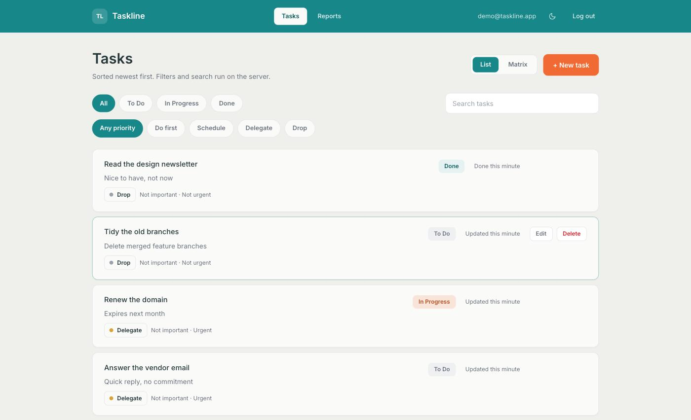
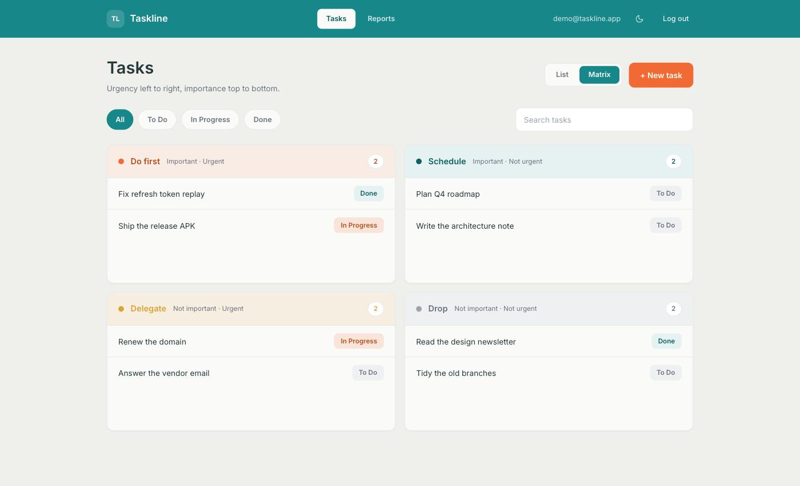
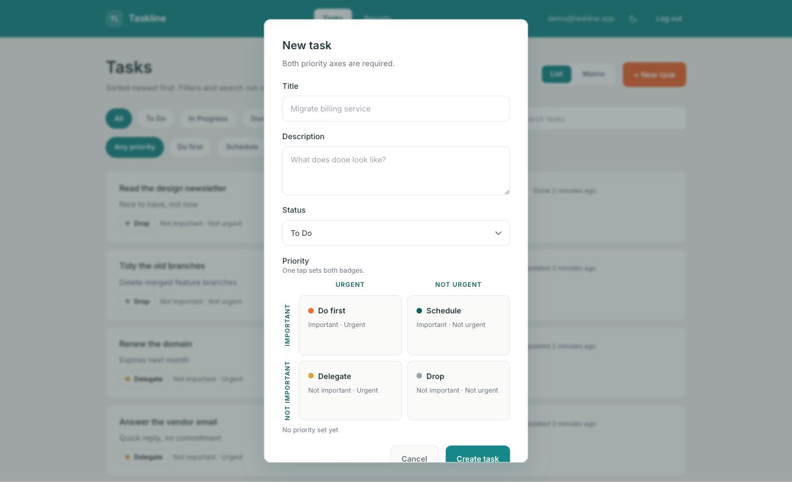
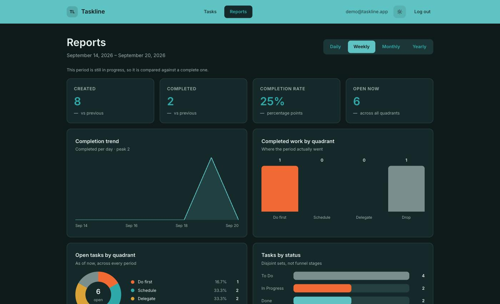
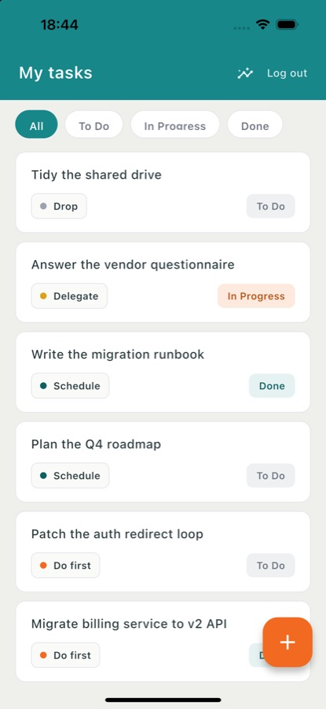

# Task Manager

Gestion de tâches avec classement selon la matrice d'Eisenhower et rapports d'activité.
API REST stateless authentifiée par JWT, et interface React qui la consomme.

```
backend/    API Spring Boot
frontend/   interface React, servie par nginx en production
docs/       architecture.md — document de conception
```

Document de conception détaillé : [`docs/architecture.md`](docs/architecture.md).

## Captures d'écran

### Interface web

| Liste des tâches | Vue matrice |
|---|---|
|  |  |

Le formulaire et sa grille 2×2 : un seul appui écrit les deux axes, et aucune paire
contradictoire n'est atteignable.



Les rapports, en thème clair puis sombre. Les graphiques sont en SVG et CSS, sans librairie.
Les indicateurs sans dénominateur affichent « — » et non « 0 % ».

| Clair | Sombre |
|---|---|
|  |  |

### Application mobile



## Stack

| Couche | Technologie |
|---|---|
| Backend | Java 21, Spring Boot 3.5.16, Spring Data JPA |
| Base de données | MySQL 8 |
| Sécurité | Spring Security, JWT (jjwt 0.13.0), BCrypt |
| Documentation API | springdoc-openapi 2.9.1 |
| Frontend | React 19, Vite 8, TypeScript, Tailwind CSS 4 |
| Routage | React Router 7 |
| Build | Maven (wrapper versionné), npm |
| Conteneurisation | Docker, Docker Compose, nginx |
| Tests | JUnit 5, MockMvc, H2 · Vitest |

**Aucune librairie de graphiques** : les cinq visualisations des rapports sont en SVG et CSS
natifs (voir « Graphiques sans librairie » plus bas).

## Installation

### Prérequis

- JDK 21 (le build cible explicitement la version 21)
- Node 20 ou plus récent
- Docker et Docker Compose, ou une instance MySQL 8 accessible
- Flutter 3.47 et Dart 3.13 pour l'application mobile uniquement

Maven n'a pas besoin d'être installé : le wrapper `./mvnw` est versionné dans le dépôt et
télécharge la version définie dans `.mvn/wrapper/maven-wrapper.properties`.

### Lancement avec Docker — tout d'un coup

```bash
cp .env.example .env    # puis renseigner les valeurs
docker compose up --build
```

| Service | URL |
|---|---|
| Interface | <http://localhost:3000> |
| API | <http://localhost:8080/api> |
| Swagger UI | <http://localhost:8080/swagger-ui.html> |

MySQL démarre avec un healthcheck et un volume persistant ; le backend attend que la base soit
saine, puis le frontend démarre.

### Lancement en développement

Deux terminaux. Le backend :

```bash
export JWT_SECRET='au-moins-32-octets-de-secret-aleatoire'
export MYSQL_PASSWORD='votre-mot-de-passe'
cd backend && ./mvnw spring-boot:run
```

Puis le frontend :

```bash
cd frontend && npm install && npm run dev
```

L'interface est sur <http://localhost:5173> et Vite proxifie `/api` vers `localhost:8080`.
Le profil backend `dev` est actif par défaut et se connecte à `localhost:3306`.

### Lancement de l'application mobile

L'application mobile consomme la même API que l'interface web. Le backend doit donc tourner
avant de la lancer.

```bash
cd mobile && flutter pub get
flutter run
```

Sans `--dart-define`, l'URL de l'API est déduite de la plateforme : `10.0.2.2:8080` sur
émulateur Android — l'émulateur ne joint jamais la machine hôte par `localhost` — et
`localhost:8080` ailleurs. Sur un téléphone physique, aucune de ces deux valeurs ne convient :
il faut passer l'adresse de la machine sur le réseau local.

```bash
flutter run --dart-define=API_BASE_URL=http://192.168.1.220:8080
```

### Construction d'un APK

```bash
flutter build apk --release --dart-define=API_BASE_URL=http://192.168.1.220:8080
```

L'APK est écrit dans `build/app/outputs/flutter-apk/app-release.apk`.

**L'URL de l'API est figée à la compilation.** Changer de réseau ou pointer vers un backend
déployé impose une reconstruction avec une autre valeur de `--dart-define` ; elle n'est pas
modifiable depuis l'application.

Deux réglages ne concernent que les builds `release`, et sont invisibles en `debug` :

- Flutter n'injecte `android.permission.INTERNET` que dans le manifeste de debug. Elle est donc
  déclarée explicitement, sinon l'application s'installe mais aucune requête ne part.
- Android 9 et ultérieur bloque le trafic HTTP en clair. La configuration
  `network_security_config.xml` l'autorise pour les seuls hôtes de développement
  (`192.168.1.220`, `10.0.2.2`, `localhost`) ; tout autre hôte reste en TLS obligatoire.

L'APK produit est signé avec la clé de debug, faute de configuration de signature de release :
il s'installe pour tester, mais n'est pas distribuable.

### Tests

```bash
cd backend  && ./mvnw verify   # 78 tests
cd frontend && npm test        # 45 tests
cd mobile   && flutter test    # 6 tests
```

Backend : unitaires sur le calcul des périodes et la rotation des jetons, intégration sur les
endpoints avec base H2 en mémoire.
Frontend : fonctions pures uniquement — correspondance des quadrants, mathématiques des
graphiques sur leurs cas dégénérés, analyse des dates. Voir « Ce qui est testé, et pourquoi si
peu » plus bas.
Mobile : correspondance des quadrants et analyse des dates. S'y ajoute un parcours d'intégration
(`flutter test integration_test/`) qui exige un backend accessible, et reste donc hors de la
commande ci-dessus.

## Intégration continue

`.github/workflows/ci.yml` — sur chaque `push` et chaque *pull request* vers `main`.

| Job | Contenu |
|---|---|
| `backend` | `./mvnw verify` (84 tests) sous `TZ=UTC` |
| `frontend` | `npm ci`, typecheck, lint, 45 tests, build Vite |
| `deploy` | Images Docker puis Cloud Run — `main` uniquement |

Les tests backend tournent sur **H2 en mémoire**, pas sur MySQL : aucun service de base de
données n'est démarré dans la CI. `TZ=UTC` est imposé au job parce que les rapports regroupent
par heure — un *runner* dans un autre fuseau décalerait chaque intervalle, exactement le bug
corrigé côté backend.

### Déploiement

Le job `deploy` ne s'exécute que si la variable de dépôt `GCP_PROJECT_ID` est définie. Tant
qu'elle ne l'est pas, il est **ignoré et non en échec** : la CI reste verte sans configuration
GCP. Pour l'activer, définir les variables de dépôt suivantes :

| Variable | Exemple |
|---|---|
| `GCP_PROJECT_ID` | `cova-509014` |
| `GCP_REGION` | `europe-west1` |
| `GCP_WORKLOAD_IDENTITY_PROVIDER` | `projects/123/locations/global/workloadIdentityPools/github/providers/repo` |
| `GCP_SERVICE_ACCOUNT` | `deployer@cova-509014.iam.gserviceaccount.com` |
| `CLOUD_SQL_INSTANCE` | `cova-509014:europe-west1:taskline` |
| `MYSQL_DATABASE` | `taskmanager` |
| `MYSQL_USER` | `taskline` |

Les secrets `jwt-secret` et `mysql-password` sont lus depuis **Secret Manager** par Cloud Run,
jamais depuis GitHub. L'authentification utilise *Workload Identity Federation* : le *runner*
échange son jeton OIDC contre des identifiants GCP, donc aucune clé de compte de service n'est
stockée dans le dépôt.

## Variables d'environnement

Aucun secret n'est versionné. Le secret JWT n'a **pas** de valeur par défaut : l'application
refuse de démarrer sans lui, et rejette une clé de moins de 32 octets (minimum HS256).

| Variable | Requis | Défaut | Rôle |
|---|---|---|---|
| `JWT_SECRET` | oui | — | Clé de signature HS256, 32 octets minimum |
| `JWT_EXPIRATION_MINUTES` | non | `15` | Durée de vie de l'access token |
| `JWT_REFRESH_DAYS` | non | `30` | Durée de vie du refresh token |
| `JWT_REFRESH_COOKIE_SECURE` | non | `false` | `true` en production (HTTPS) |
| `MYSQL_DATABASE` | oui | `taskmanager` (dev) | Nom de la base |
| `MYSQL_USER` | oui | `root` (dev) | Utilisateur |
| `MYSQL_PASSWORD` | oui | — | Mot de passe |
| `MYSQL_HOST` | non | `localhost` (dev), `mysql` (docker) | Hôte |
| `MYSQL_PORT` | non | `3306` | Port |
| `MYSQL_ROOT_PASSWORD` | oui (docker) | — | Mot de passe root du conteneur |
| `BACKEND_PORT` | non | `8080` | Port exposé de l'API |
| `FRONTEND_PORT` | non | `3000` | Port exposé de l'interface |

## Documentation de l'API

Swagger UI : <http://localhost:8080/swagger-ui.html> — schéma OpenAPI :
`/v3/api-docs`. Le schéma de sécurité `bearerAuth` est déclaré, ce qui permet d'essayer les
endpoints authentifiés directement depuis l'interface.

## Endpoints

Base : `/api`. Toutes les routes sauf `/api/auth/**` exigent un en-tête
`Authorization: Bearer <token>`.

| Méthode | Route | Description |
|---|---|---|
| POST | `/api/auth/register` | Inscription, renvoie un JWT |
| POST | `/api/auth/login` | Connexion, renvoie un JWT |
| POST | `/api/auth/refresh` | Rotation du refresh token, renvoie un nouvel access token |
| POST | `/api/auth/logout` | Révoque la famille de jetons et efface le cookie |
| GET | `/api/tasks` | Liste paginée, filtrée, recherchée |
| POST | `/api/tasks` | Création |
| GET | `/api/tasks/{id}` | Détail |
| PUT | `/api/tasks/{id}` | Modification |
| DELETE | `/api/tasks/{id}` | Suppression |
| GET | `/api/reports/summary` | Indicateurs de synthèse et variation |
| GET | `/api/reports/trend` | Série temporelle des tâches terminées |
| GET | `/api/reports/quadrants` | Tâches terminées par quadrant sur la période |
| GET | `/api/reports/distribution` | Tâches ouvertes par quadrant, à l'instant présent |
| GET | `/api/reports/heatmap` | Tâches terminées par jour sur une année |

Paramètres de `GET /api/tasks` :
`?page=&size=&status=&importance=&urgency=&quadrant=&search=`

Paramètres des rapports : `?period=DAILY|WEEKLY|MONTHLY|YEARLY` et `zone` optionnel
(ex. `Africa/Douala`, UTC par défaut). `heatmap` prend `?year=`.

### Format d'erreur

Toutes les erreurs partagent une enveloppe unique, pour que le client n'écrive la logique de
traitement qu'une fois :

```json
{
  "timestamp": "2026-09-17T14:23:11Z",
  "status": 400,
  "message": "validation failed",
  "errors": { "importance": "must not be null" }
}
```

`errors` est omis quand l'erreur ne porte pas sur des champs.

## Architecture

Découpage **par domaine** :

```
com.taskmanager/
├── config/     SecurityConfig, OpenApiConfig, JpaAuditingConfig
├── security/   JwtService, JwtAuthenticationFilter, CustomUserDetailsService
├── user/       User, UserRepository, AuthController, AuthService, dto/
├── task/       Task, TaskStatus, Importance, Urgency, Quadrant,
│               TaskRepository, TaskController, TaskService, dto/
├── report/     ReportController, ReportService, PeriodResolver, dto/
└── common/     GlobalExceptionHandler, ApiError, BaseEntity, exception/
```

Règles transverses : aucune entité JPA exposée dans un controller (DTO en entrée et en sortie),
logique métier dans les services, gestion des erreurs centralisée dans un
`@RestControllerAdvice`.

### Frontend

Même principe : découpage par domaine, pas par type de fichier.

```
src/
├── api/        client.ts (instance unique + intercepteurs), authApi, taskApi, reportApi,
│               datetime.ts (analyse UTC)
├── auth/       AuthContext, useAuth, ProtectedRoute
├── theme/      ThemeProvider, jetons clair/sombre
├── components/ ui/ (boutons, champs, badges, modale…), layout/, toast/
├── features/
│   ├── auth/    LoginPage, RegisterPage, jauge de mot de passe
│   ├── tasks/   TaskListPage, TaskCard, TaskForm, QuadrantSelector, TaskMatrix,
│   │            quadrant.ts (table de correspondance), useTasks, useTaskFilters
│   ├── reports/ ReportsPage, charts/ (5 graphiques), chartMath.ts, useReports
│   └── preview/ galerie de composants, développement uniquement
└── types/      miroir exact des DTO du backend
```

Les types TypeScript reflètent les records Java : `TaskInput` **n'a aucun champ `quadrant`**,
et les taux des rapports sont `number | null`. Une divergence de contrat devient une erreur de
compilation plutôt qu'un bug à l'exécution.

## Choix techniques

### Découpage par domaine plutôt que par type technique

Un découpage `controllers/ services/ repositories/` regroupe les fichiers par nature et
disperse chaque fonctionnalité dans trois dossiers. Le découpage par domaine rassemble tout ce
qui concerne une notion au même endroit : une fonctionnalité se lit, se teste et se supprime
d'un bloc.

### Deux axes enum, et non une collection de badges

Chaque tâche porte deux qualificatifs obligatoires, un par axe : `Importance`
(`IMPORTANT` / `NOT_IMPORTANT`) et `Urgency` (`URGENT` / `NOT_URGENT`), modélisés comme **deux
champs enum distincts et non nuls**.

C'est la décision structurante du modèle. Avec deux axes séparés, une combinaison
contradictoire — importante *et* non importante — est **impossible à représenter**. Aucune
validation applicative n'est nécessaire pour l'interdire : la structure des données s'en charge.
Une collection de badges aurait exigé un validateur personnalisé, donc une règle vivant dans le
code plutôt que dans le modèle, contournable par tout point d'entrée qui l'oublierait.

Le schéma généré le confirme : deux colonnes `not null`, et aucune colonne de quadrant.

### Quadrant dérivé, jamais persisté

Le croisement des deux axes donne quatre quadrants :

| importance | urgency | quadrant |
|---|---|---|
| `IMPORTANT` | `URGENT` | `DO_FIRST` |
| `IMPORTANT` | `NOT_URGENT` | `SCHEDULE` |
| `NOT_IMPORTANT` | `URGENT` | `DELEGATE` |
| `NOT_IMPORTANT` | `NOT_URGENT` | `DROP` |

Le quadrant est calculé dans le domaine (`Quadrant.of(importance, urgency)`), exposé en lecture,
et **jamais accepté en écriture** : `TaskRequest` ne comporte aucun champ `quadrant`, il n'existe
donc pas de chemin d'écriture à valider. Le persister créerait une donnée dénormalisée pouvant
diverger de ses deux sources.

Le filtre `?quadrant=` est traduit dans le service en couple (importance, urgency) ; il
n'atteint jamais la base tel quel.

### 404 et non 403 sur une ressource appartenant à autrui

Toute requête sur une tâche filtre par propriétaire au niveau du repository —
`findByIdAndUserId(id, currentUserId)`, jamais `findById(id)` suivi d'une vérification en Java :
la contrainte vit dans la requête, pas dans un contrôle qu'on peut oublier d'écrire.

Une tâche introuvable **ou appartenant à un autre utilisateur** renvoie **404**. Répondre 403
confirmerait l'existence de la ressource et permettrait d'énumérer les identifiants valides.
Pour la même raison, un échec de connexion renvoie `invalid credentials` sans indiquer si
l'adresse existe.

L'identité de l'utilisateur courant provient exclusivement du `SecurityContext`, jamais d'un
paramètre de requête ni d'un champ du corps.

### Refresh token : rotation, détection de rejeu, cookie httpOnly

L'access token vit **15 minutes**, le refresh token **30 jours**. Un access token volé n'est donc
exploitable que le temps d'une pause café ; c'est le refresh qui a de la valeur, et c'est lui
qu'on protège.

**Le refresh token ne transite que par un cookie `httpOnly`**, `SameSite=Strict`, `Path=/api/auth`.
Il n'apparaît jamais dans le corps JSON (`@JsonIgnore` sur le champ), donc **aucun JavaScript ne
peut le lire** : une faille XSS qui viderait le `localStorage` n'emporterait que l'access token
court-vivant. Le `Path` restreint l'envoi du cookie aux seules routes d'authentification, ce qui
réduit d'autant la surface CSRF. `Secure` est activable par variable d'environnement, désactivé
en développement pour fonctionner en HTTP sur `localhost`.

**Rien n'est stocké en clair.** La table `refresh_tokens` ne contient qu'une empreinte SHA-256,
au même titre qu'un mot de passe : une copie de la base ne permet de rejouer aucune session.

**Rotation à chaque usage.** Chaque appel à `/api/auth/refresh` consomme le jeton présenté et en
émet un nouveau. Un jeton n'est donc valide qu'une fois.

**Détection de rejeu.** C'est ce que la rotation permet de construire. Si un jeton **déjà
consommé** est représenté, c'est qu'il en existe une copie : le porteur légitime l'a forcément
déjà échangé. Le serveur révoque alors **toute la famille** de rotation — y compris le jeton
courant du porteur légitime. Ce dernier est déconnecté, ce qui est voulu : on ne peut pas
distinguer la victime de l'attaquant, donc on coupe les deux plutôt que de laisser le voleur
dans la place.

Le stockage en base est ce qui rend ces trois propriétés vraies. Un refresh token *stateless*
(un second JWT signé) éviterait la table, mais le serveur ne se souviendrait de rien : la
révocation au logout serait une politesse côté client, et le rejeu serait indétectable — un
jeton volé resterait valide jusqu'à son expiration. La table est le prix de la révocabilité.

Un job `@Scheduled` purge chaque nuit les jetons expirés.

### Filtrage et agrégation côté serveur

La pagination, les filtres et la recherche sont exécutés **en base**, via une `Specification`
composée dont le prédicat propriétaire est toujours appliqué. Filtrer en JavaScript sur un
tableau déjà chargé fonctionne sur trente tâches et s'effondre sur trois mille.

Les rapports agrègent de même en base, par `GROUP BY`. Charger toutes les tâches en mémoire pour
les compter dans une boucle Java est proscrit : le coût croîtrait linéairement avec
l'historique.

La distinction appliquée est celle-ci : **compter** en Java est interdit — le nombre de lignes
traversant JDBC croîtrait avec l'historique ; **compléter** une série en Java est requis — les
lignes sont des comptes déjà calculés, bornés par la longueur de la période demandée, et le
travail consiste à insérer des zéros là où la base n'avait aucune ligne. Les intervalles sans
donnée sont renvoyés à zéro, jamais omis : sinon chaque client réimplémenterait la même logique
de remplissage.

Le regroupement par quadrant se fait sur `(importance, urgency)` en SQL, puis le couple est mappé
vers `Quadrant` en Java. La base renvoie au plus quatre lignes portant déjà leur `count(*)` :
c'est du mapping, pas de l'agrégation. Un `CASE` SQL dupliquerait `Quadrant.of()` dans du texte
de requête, avec le risque de divergence.

### La grille 2×2 rend l'état invalide inatteignable

Le backend garantit qu'une paire contradictoire est irreprésentable ; l'interface applique le
même principe plutôt que de le contredire.

Le sélecteur de priorité est une grille 2×2 — urgence en abscisse, importance en ordonnée — où
**une cellule *est* un couple `{importance, urgency}`**. Un seul tap écrit les deux axes en une
opération, donc aucun rendu intermédiaire ne voit un axe renseigné et l'autre vide. Deux listes
déroulantes séparées auraient permis de composer une saisie que le backend rejette ; la grille
rend cette saisie impossible à formuler.

Le formulaire n'envoie **jamais** de champ `quadrant` : il n'existe pas sur `TaskInput`, donc le
chemin d'écriture n'est pas seulement validé — il est absent du type. Le quadrant affiché vient
de la réponse du serveur.

Une seule table (`quadrant.ts`) porte la correspondance dans les deux sens, et elle est testée
dans les deux sens : c'est le miroir exact de `Quadrant.java`, et une divergence silencieuse
mal-étiquetterait toutes les tâches.

### Renouvellement de session silencieux

Sur un 401, l'intercepteur tente **une fois** `POST /api/auth/refresh`, rejoue la requête
d'origine si le renouvellement réussit, et ne redirige vers `/login` que s'il échoue. L'access
token expire en 15 minutes ; l'utilisateur ne s'en aperçoit pas.

Les appels concurrents pendant un renouvellement sont **mis en file derrière une promesse
unique**. Sans cela, cinq requêtes simultanées déclencheraient cinq rotations, et la détection
de rejeu du backend — qui fait son travail — y verrait un vol et révoquerait toute la famille.

Trois garde-fous évitent la boucle de redirection : les 401 de `/api/auth/**` ne sont jamais
interceptés (un mot de passe faux doit rester une erreur inline), rien ne se déclenche sans
jeton, et aucune redirection n'a lieu si l'on est déjà sur `/login`.

### Même origine, donc pas de CORS

En développement, Vite proxifie `/api` vers `localhost:8080`. En production, nginx sert les
fichiers statiques et proxifie `/api` vers le conteneur backend. Dans les deux cas le navigateur
ne voit qu'une seule origine : le cookie `SameSite=Strict` est envoyé normalement, et
**la configuration de sécurité du backend n'a pas eu besoin d'être modifiée**.

nginx renvoie `index.html` pour toute route inconnue, afin qu'un lien profond comme `/reports`
fonctionne au rechargement.

